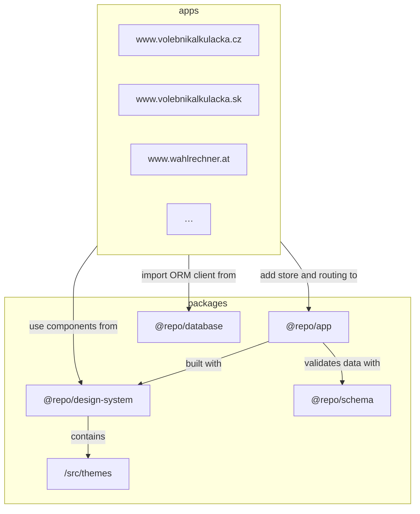

# Kalkulacka.1 platform architecture

The Kalkulacka.1 voting advice application platform is composed of modular components reused across (usually country-specific) instances of the voting advice application. The architecture is designed to be modular and reusable, allowing for easy customization and deployment in different contexts, including embedding in other websites.

All components are in a monorepo, which follows a [Turborepo](https://turborepo.com)-based structure, divided into two main directories:

- `/apps`, which contains the Next.js applications (websites) for each country (plus other websites like the Kalkulacka.1 project website)
- `/packages`, which contains shared libraries and components

## Voting advice application instances

Every voting advice application instance is a Next.js application that serves as a website for a specific voting advice application instance.

Each instance is built independently and can be fully customized, but uses the shared libraries and components. In addition to custom content, each instance handles routing logic for the app.

Each application in the `/apps` directory is named after the full production URL of the instance, such as `www.volebnikalkulacka.cz` or `www.wahlrechner.at`.

## App

The app package is the core of the voting advice application. It provides composed components, layouts, state and store management, result calculation logic and other core features.

It is a standalone React package that can be used in any React-based project.

It uses the design system for presentational components and themes, and the schema package for data validation and type definitions.

## Design system

The design system package is a shared library that contains presentational components to ensure a consistent look and feel.

It also contains themes, which are used to customize the design system for different voting advice application instances. The themes are stored in the `/src/themes` directory and can be easily extended or modified.

The design system is documented with [Storybook](https://storybook.js.org) located inside `/apps/design-system.kalkulacka.one`.

## Database

The database package defines the database schema and provides an ORM client for interacting with the database. It is used by the individual instances to manage their data.

## Schemas

The schema package defines the data model for the voting advice application data. It is used to validate the data and provide type definitions for the app.

Schemas are documented with [ReDoc](https://redocly.com) located inside `/apps/schema.kalkulacka.one`.
