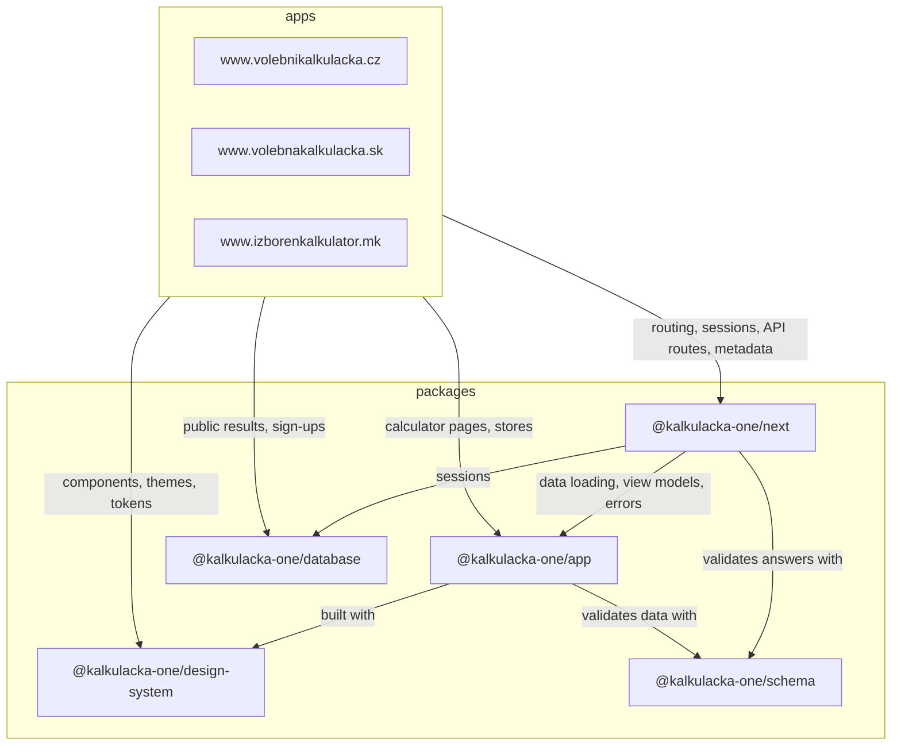

# Kalkulacka.1 platform architecture

The Kalkulacka.1 voting advice application platform is composed of modular components reused across (usually country-specific) instances of the voting advice application. The architecture is designed to be modular and reusable, allowing for easy customization and deployment in different contexts, including embedding in other websites.

All components are in a monorepo, which follows a [Turborepo](https://turborepo.com)-based structure, divided into two main directories:

- `/apps`, which contains the Next.js applications (websites) for each country (plus other websites like the Kalkulacka.1 project website)
- `/packages`, which contains shared libraries and components

```mermaid
graph TD
  subgraph apps [apps]
    CZ["www.​volebnikalkulacka.cz"]
    SK["www.​volebnakalkulacka.sk"]
    MK["www.​izborenkalkulator.mk"]
  end

  subgraph packages [packages]
    next["`@kalkulacka-one/next`"]
    app["`@kalkulacka-one/app`"]
    design-system["`@kalkulacka-one/design-system`"]
    schema["`@kalkulacka-one/schema`"]
    database["`@kalkulacka-one/database`"]
  end

  apps -->|routing, sessions, API routes, metadata| next
  apps -->|calculator pages, stores| app
  apps -->|components, themes, tokens| design-system
  apps -->|public results, sign-ups| database
  next -->|data loading, view models, errors| app
  next -->|sessions| database
  next -->|validates answers with| schema
  app -->|built with| design-system
  app -->|validates data with| schema
```

## Voting advice application instances

Every calculator instance – `www.volebnikalkulacka.cz`, `www.volebnakalkulacka.sk` and `www.izborenkalkulator.mk` – is a Next.js application named after its production domain. `www.voksmonitor.hu` is currently a landing page only, `www.kalkulacka.one` is the project website, and `design-system.kalkulacka.one` and `schema.kalkulacka.one` host the component and schema documentation.

The calculator logic lives in the packages. An instance keeps what is specific to its country: configuration (`config/`), translations and localized URL slugs (`messages/`), content pages, themes, the header, footer and donation card, and the Next.js route files.

A calculator page is composed in three layers:

1. **Route file** – `app/[locale]/(web)/(app)/…/page.tsx` reads the URL, runs the guards and sets the metadata.
2. **Wrapper** – `components/client/pages/calculator/*` connects the page to routing, the stores and session persistence.
3. **Page component** – from `@kalkulacka-one/app`; it takes data and callbacks as props and knows nothing about routing.

The `(app)` and `(embed)` route trees, the wrappers, `lib/` and `hooks/` are kept identical across the three calculator instances (the result page wrapper differs only by each country's donation card). A change to any of them has to be made in all three.

## Next

The next package connects the app package to Next.js. It is the only package that depends on Next.js, and it provides:

- routing – URL builders and parsers (`createRouting`), localized rewrites (`createRewrites`) and the guards used in route files
- sessions – cookie handling and the API route handlers, which instances re-export from `app/api/**/route.ts`
- metadata, `robots.txt` and analytics helpers
- `withDefaults()` for an instance's `config/app-config.ts`

## App

The app package is the core of the voting advice application. It provides the calculator pages and their components, the state stores, view models, data loading and the result calculation.

It is a standalone React package with no Next.js dependency, so it can be used in any React-based project. Its entry points are `@kalkulacka-one/app` (pages, components, data loading, result calculation), `@kalkulacka-one/app/client` (stores, embed context and client-only components) and `@kalkulacka-one/app/styles`.

It uses the design system for presentational components and the schema package for data validation and type definitions.

## Design system

The design system package is a shared library that contains presentational components to ensure a consistent look and feel.

It also contains themes, which customize the design system for different voting advice application instances. A theme is a CSS file in `/src/themes/<domain>/<name>.css` that sets a few input values – a palette (`--ko-palette-*`) and typefaces (`--ko-typeface-*`). The design system derives its tokens from them, such as `--ko-color-primary` with its hover, active and disabled variants. Each instance loads a theme at runtime, and an embed can use a partner's theme (see `config/embeds.ts`).

The design system is documented with [Storybook](https://storybook.js.org) located inside `/apps/design-system.kalkulacka.one`.

## Styling

The design system, the app package and each instance have their own [Tailwind CSS](https://tailwindcss.com) build:

| Build | Class prefix | Generates classes found in |
| --- | --- | --- |
| `@kalkulacka-one/design-system` | `ko:` | `packages/design-system/src` |
| `@kalkulacka-one/app` | `koa:` | `packages/app/src` |
| each instance | none | `apps/<instance>` |

A build only generates the classes it finds in its own files, so a class written with another build's prefix produces no CSS.

The packages ship compiled stylesheets in cascade layers and without a global reset, so they can be used inside another website. An instance gets the reset from its own `@import "tailwindcss"`.

`@kalkulacka-one/design-system/tokens.css` exposes the design system's tokens to the other builds under names without the prefix. An instance can write `text-primary`, and the app package `koa:text-primary`, and both follow the loaded theme.

## Database

The database package defines the database schema and provides an ORM client for interacting with the database. It stores user data only – calculator sessions, their answers and results, and subscriptions – never election content.

Sessions are accessed through the next package. Instances use the database directly for public results and sign-ups.

## Schemas

The schema package defines the data model for the voting advice application data. It is used to validate the data and provide type definitions for the app.

Election data is not stored in this repository; instances fetch it at request time from `DATA_ENDPOINT`. The schema package is also the contract with the [data repository](https://github.com/kalkulacka-one/data), whose CI validates the content against the JSON Schemas published at `schema.kalkulacka.one`.

Schemas are documented with [ReDoc](https://redocly.com) located inside `/apps/schema.kalkulacka.one`.
