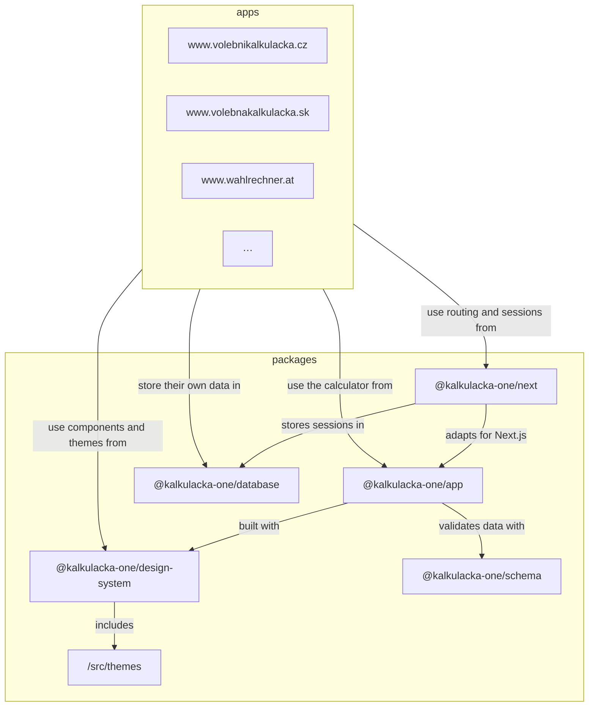

# Kalkulacka.1 platform architecture

The Kalkulacka.1 voting advice application platform is composed of modular components reused across (usually country-specific) instances of the voting advice application. The architecture is designed to be modular and reusable, allowing for easy customization and deployment in different contexts, including embedding in other websites.

All components are in a monorepo, which follows a [Turborepo](https://turborepo.com)-based structure, divided into two main directories:

- `/apps`, which contains the Next.js applications (websites) for each country (plus other websites like the Kalkulacka.1 project website)
- `/packages`, which contains shared libraries and components

```mermaid
graph TD
  subgraph apps [apps]
    CZ["www.​volebnikalkulacka.cz"]
    SK["www.​volebnakalkulacka.sk"]
    AT["www.​wahlrechner.at"]
    etc["…"]
  end

  subgraph packages [packages]
    next["`@kalkulacka-one/next`"]
    app["`@kalkulacka-one/app`"]
    design-system["`@kalkulacka-one/design-system`"]
    themes["`/src/themes`"]
    schema["`@kalkulacka-one/schema`"]
    database["`@kalkulacka-one/database`"]
  end

  apps -->|use routing and sessions from| next
  apps -->|use the calculator from| app
  apps -->|use components and themes from| design-system
  apps -->|store their own data in| database
  next -->|adapts for Next.js| app
  next -->|stores sessions in| database
  app -->|built with| design-system
  design-system -->|includes| themes
  app -->|validates data with| schema
```

## Voting advice application instances

An instance is a Next.js application that serves a single voting advice application as a website.

Each instance is built independently and can be fully customized, but uses the shared libraries and components. The calculator itself comes from the packages; an instance adds its own content and branding, and configures how the shared calculator is published — its locales, its URLs, its themes and its embeds.

Each application in the `/apps` directory is named after the full production URL of the instance, such as `www.volebnikalkulacka.cz` or `www.wahlrechner.at`.

A calculator screen is assembled from three parts: a route, a thin connecting layer that supplies routing, state and persistence, and a presentational screen from the app package that renders what it is handed and knows nothing about where it is mounted.

Where that connecting layer still lives in the instances, it is deliberately identical in all of them, so the calculator behaves the same everywhere. A change to it belongs in every instance — or better, in the packages.

## Next

The next package integrates the app package with Next.js, and is the only package that depends on it. It provides the routing, the sessions and the endpoints behind them, the configuration an instance is wired up with, and the metadata and SEO.

## App

The app package is the core of the voting advice application. It provides composed components, layouts, state and store management, result calculation logic and other core features. It also carries the translations and styles for everything it renders.

It is a standalone React package that can be used in any React-based project.

It uses the design system for presentational components and themes, and the schema package for data validation and type definitions.

## Design system

The design system package is a shared library that contains presentational components to ensure a consistent look and feel.

It also contains themes, which are used to customize the design system for different voting advice application instances. The themes are stored in the `/src/themes` directory and can be easily extended or modified. A theme supplies a palette and typefaces, from which the design system derives its tokens; those tokens are published to the app package and the instances, so everything follows the same theme.

The design system is documented with [Storybook](https://storybook.js.org) located inside `/apps/design-system.kalkulacka.one`.

## Database

The database package defines the database schema and provides an ORM client for interacting with the database. It holds user data only — sessions, answers and results, and newsletter sign-ups — never election data.

## Schemas

The schema package defines the data model for the voting advice application data. It is used to validate the data and provide type definitions for the app.

Election data is not stored in this repository; it is fetched at run time from `DATA_ENDPOINT` and cached briefly.

Schemas are documented with [ReDoc](https://redocly.com) located inside `/apps/schema.kalkulacka.one`.
